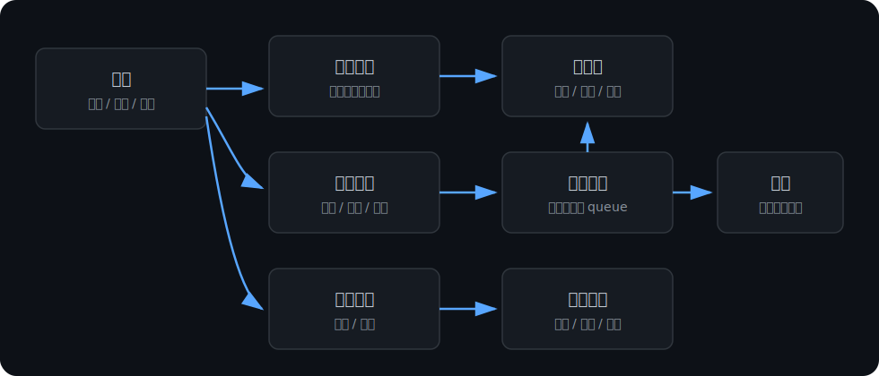
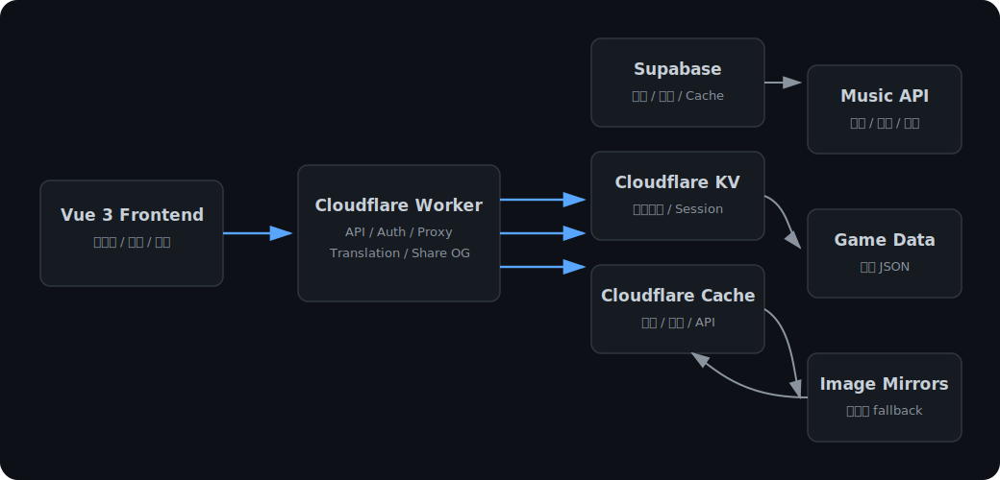

# Arknights Music Web

一個以塞壬唱片與明日方舟角色資料為核心的音樂播放器網站。網站可以瀏覽專輯、播放歌曲、查看歌詞與翻譯、分享歌曲連結，也支援登入後建立自己的歌單、收藏歌曲與角色清單。

## 主要功能

- 瀏覽塞壬唱片專輯與歌曲。
- 播放歌曲，支援音量、進度、上一首/下一首、循環、單曲循環、隨機播放。
- 查看歌曲詳情、專輯資訊、歌詞與歌詞翻譯。
- 分享歌曲連結，支援 Open Graph 預覽。
- 多國語系介面。
- 登入後可使用：
  - 我的最愛歌曲
  - 自訂歌單
  - 自訂角色清單
- 查看幹員圖鑑與角色詳情。
- 製作招募卡。

## 專案畫面與流程



## 快速開始

```bash
npm install
npm run dev
```

預設開發網址通常是：

```txt
http://localhost:3000/
```

建置正式版：

```bash
npm run build
```

預覽正式版：

```bash
npm run preview
```

## 專案文件

- [功能規格文件](docs/specification.md)
- [開發與維護手冊](docs/maintenance.md)
- [技術線與架構文件](docs/technical-stack.md)
- [Cloudflare Worker API 筆記](docs/cloudflare-recruit-api.md)
- [使用者資料庫 Schema](docs/user-library-schema.sql)
- [GitHub Pages 部署筆記](docs/deployment/github-pages.md)

## 技術概覽



前端使用 Vue 3 + Vite。音樂、角色、翻譯、使用者歌單與收藏等資料主要透過 Cloudflare Worker 統一存取，並搭配 Supabase 與 Cloudflare KV/cache 降低外部 API 與 GitHub raw 的不穩定性。

