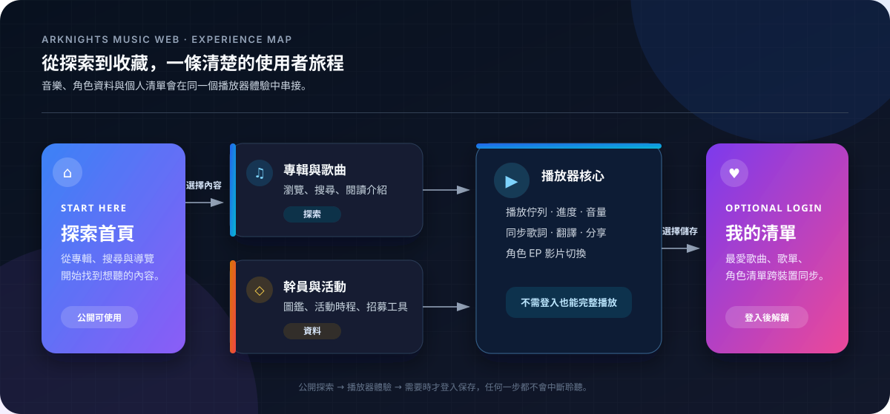
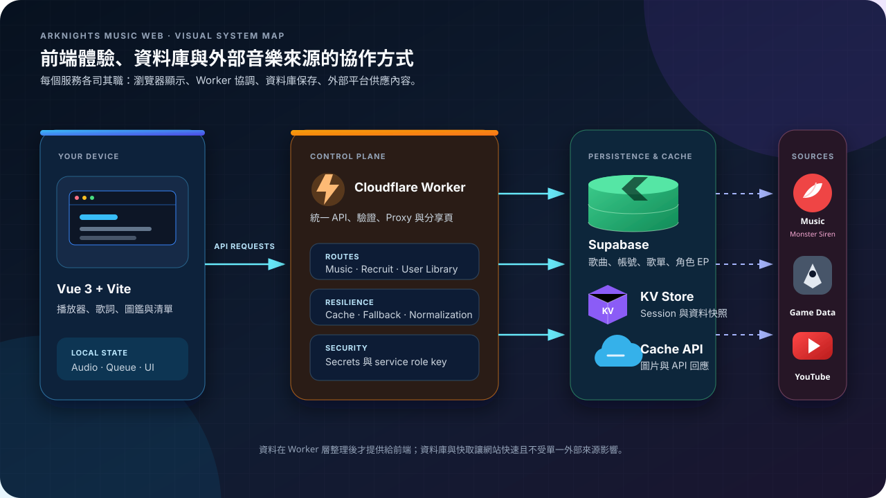
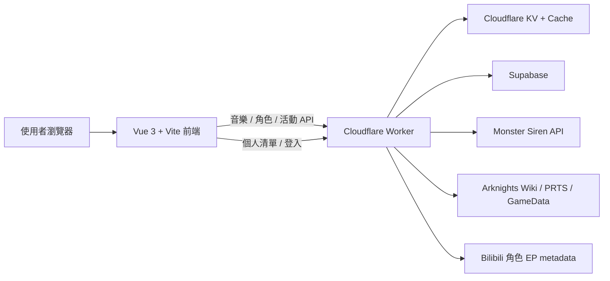
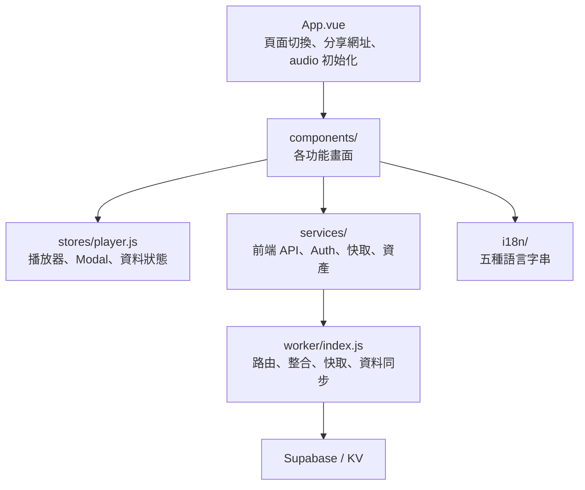

# Arknights Music Web

> 以塞壬唱片、明日方舟幹員與活動資料為核心的音樂播放器與資料工具網站。



| 面向 | 內容 |
| --- | --- |
| 前端 | Vue 3、Vite、Vue I18n、原生 HTML Audio |
| 後端 | Cloudflare Worker、Cloudflare KV / Cache API、Supabase |
| 支援語言 | 繁中、簡中、英文、日文、韓文 |
| 部署方式 | GitHub Pages（前端）+ Cloudflare Workers（API） |
| 主要資料 | Monster Siren 音樂資料、Arknights Wiki / PRTS、遊戲資料與 Supabase |

## 功能一覽

| 功能區 | 使用者可以做什麼 | 主要實作 |
| --- | --- | --- |
| 音樂播放器 | 瀏覽專輯、搜尋、播放歌曲、切歌、調整進度與音量 | `AlbumList.vue`、`PlayerView.vue`、`stores/player.js` |
| 播放模式 | 循環播放、單曲循環、隨機播放；播放佇列會保留專輯或歌單範圍 | `stores/player.js` |
| 歌詞 | 顯示同步歌詞，按需取得翻譯；切歌時翻譯預設關閉 | `PlayerView.vue`、`lyricsTranslationPlugin.js` |
| 角色 EP | 有已配對影片時，可在播放器切換封面與 Bilibili 嵌入影片 | `PlayerView.vue`、`/api/song/:id/character-ep` |
| 幹員圖鑑 | 搜尋與篩選幹員，檢視立繪、技能、模組、材料與檔案資訊 | `CharacterList.vue`、`CharacterDetails.vue` |
| 招募工具 | 製作招募卡，依伺服器資料計算公開招募標籤結果 | `RecruitCardMaker.vue`、`RecruitmentCalculator.vue` |
| 活動資料 | 依伺服器檢視活動時程、招募池與免費幹員資料 | `ActivityList.vue` |
| 帳號與我的清單 | 以登入 Key 建立帳號，管理最愛歌曲、歌單、角色清單 | `AuthView.vue`、`UserLibraryView.vue` |
| 分享 | 以網址直接開啟歌曲或幹員；歌曲分享頁提供 Open Graph 預覽 | `App.vue`、Worker `/share/song/:id` |

## 使用方式

### 遊客

1. 在「專輯」頁搜尋或選擇專輯，點選歌曲即可播放。
2. 在播放器中切換播放模式、歌詞翻譯，或在有資料時開啟「角色 EP」。
3. 從「幹員圖鑑」或「活動」頁查看詳細資料；公開招募可使用標籤計算器。
4. 右上角可切換介面語言。

### 登入使用者

1. 以唯一的登入 Key 與密碼註冊或登入。
2. 在歌曲或幹員相關操作中加入最愛、歌單或角色清單。
3. 到「我的清單」管理已儲存內容；資料由帳號同步，而非僅存於瀏覽器。

> 未登入不影響瀏覽、播放、圖鑑或招募工具；登入只解鎖個人收藏與清單。

## 系統架構




```mermaid
flowchart LR
  U["使用者瀏覽器"] --> F["Vue 3 + Vite 前端"]
  F -->|"音樂 / 角色 / 活動 API"| W["Cloudflare Worker"]
  F -->|"個人清單 / 登入"| W
  W --> K["Cloudflare KV + Cache"]
  W --> S["Supabase"]
  W --> M["Monster Siren API"]
  W --> G["Arknights Wiki / PRTS / GameData"]
  W --> B["Bilibili 角色 EP metadata"]
```

資料流原則：前端只處理顯示、互動與本機播放狀態；外部來源、快取、帳號驗證與 Supabase 存取集中由 Worker 協調。這能減少 CORS、GitHub raw 限流與來源格式變動直接影響使用者。

## 快速開始

需求：Node.js 18+（部署流程使用 Node 18；角色 EP 同步工作流使用 Node 22）。

```bash
npm install
npm run dev
```

開發伺服器預設為 `http://localhost:3000/`；若埠號被占用，Vite 會自動選擇下一個可用埠。

| 目的 | 指令 |
| --- | --- |
| 開發伺服器 | `npm run dev` |
| 前端正式建置 | `npm run build` |
| 可攜式相對路徑建置 | `npm run build:portable` |
| 預覽建置結果 | `npm run preview` |
| Worker 本機開發 | `npm run worker:dev` |
| Worker 語法檢查 | `node --check worker/index.js` |
| 檢查幹員本機資產 | `npm run assets:audit` |
| 同步幹員本機資產 | `npm run assets:sync` |
| 同步角色 EP metadata | `npm run character-eps:sync` |

## 設定與機密資料

### 前端環境變數

| 變數 | 用途 | 預設行為 |
| --- | --- | --- |
| `VITE_MUSIC_API_ORIGIN` | 指向 Worker 的音樂 API | 未設定時直連 Monster Siren API |
| `VITE_RECRUIT_API_BASE` | 指向幹員、活動與招募 API | 使用正式 Worker URL |

前端可建立未提交的 `.env.local`：

```env
VITE_MUSIC_API_ORIGIN=https://<your-worker>.workers.dev
VITE_RECRUIT_API_BASE=https://<your-worker>.workers.dev
```

### Worker bindings / secrets

| 名稱 | 類型 | 用途 | 是否可提交 |
| --- | --- | --- | --- |
| `ARKNIGHTS_DATA` | KV binding | 快取、帳號與 session | 設定名稱可提交；正式 namespace ID 請謹慎處理 |
| `SUPABASE_URL` | Worker variable | Supabase REST 位置 | 可作公開設定 |
| `LYRICS_PREWARM_LOCALES` | Worker variable | 歌詞預熱語言 | 可提交 |
| `BILIBILI_EP_SOURCE_UID` | Worker variable | 角色 EP 來源 UP 主 ID | 可提交 |
| `SYNC_TOKEN` | Worker secret | 保護 admin 同步 API | **不可提交** |
| `SUPABASE_SERVICE_ROLE_KEY` | Worker / CI secret | Supabase 寫入與管理操作 | **不可提交** |
| `BILIBILI_SESSDATA` | GitHub secret（選用） | 降低 Bilibili 反自動化失敗率 | **不可提交** |

## 維護地圖


```mermaid
flowchart TB
  App["App.vue\n頁面切換、分享網址、audio 初始化"]
  App --> UI["components/\n各功能畫面"]
  UI --> State["stores/player.js\n播放器、Modal、資料狀態"]
  UI --> Services["services/\n前端 API、Auth、快取、資產"]
  Services --> Worker["worker/index.js\n路由、整合、快取、資料同步"]
  UI --> I18n["i18n/\n五種語言字串"]
  Worker --> DB["Supabase / KV"]
```

| 想修改的內容 | 優先查看 | 注意事項 |
| --- | --- | --- |
| 頁面或導覽 | `src/App.vue`、`src/components/Navbar.vue` | 此專案目前以 `currentPage` 切換頁面，未使用 Vue Router |
| 播放行為 / queue | `src/stores/player.js` | 請保留「來源播放清單」語意，避免隨機播放越出專輯或歌單 |
| 播放器 UI / EP | `src/components/PlayerView.vue` | EP 為第三方 iframe；不下載或代理影片串流 |
| 音樂 API | `src/services/api.js`、`worker/index.js` | 前端可直接來源或改走 Worker mirror |
| 幹員 / 招募 | `Character*.vue`、`RecruitmentCalculator.vue`、Worker recruit routes | 圖片優先使用本機 manifest / Worker proxy 與 fallback |
| 活動資料 | `ActivityList.vue`、`activityApi.js`、`activityCatalog.js` | 資料會依 CN / Global / TW 伺服器時間窗不同 |
| 帳號與個人清單 | `auth.js`、`userLibrary.js`、Worker auth/user routes | 使用者資料 schema 在 `docs/user-library-schema.sql` |
| 文字與翻譯 | `src/i18n/`、`userLibraryMessages.js` | 新增 UI 字串時同步五種語言；不要把文字硬編碼在元件 |
| 外觀 | `public/styles.css` 與元件 scoped style | 注意 GitHub Pages base path 下的資產路徑 |

完整維護程序請見 [維護手冊](docs/maintenance.md)，資料庫與後端細節請見 [技術架構](docs/technical-stack.md)。

## 資料夾結構

```text
ArknightMusicWeb/
├─ src/                         # 前端原始碼
│  ├─ components/               # 頁面與功能元件
│  ├─ composables/              # Vue 組合式邏輯
│  ├─ data/                     # 活動、卡池等整理後的資料
│  ├─ directives/               # 自訂 directive
│  ├─ i18n/                     # 語系設定與翻譯字典
│  ├─ services/                 # API、登入、快取、資產服務
│  ├─ stores/                   # 共用 reactive state
│  └─ utils/                    # 純函式工具
├─ public/                      # 原樣輸出的靜態資產（圖示、立繪、manifest、CSS）
├─ worker/                      # Cloudflare Worker API 與同步邏輯
├─ scripts/                     # 資產、活動卡池、角色 EP 同步工具
├─ docs/                        # 規格、維護、部署、SQL、Wiki 原始頁面
├─ .github/workflows/           # Pages 部署與排程同步
├─ dist/                        # 建置產物；自動生成，不提交
├─ dist-portable/               # 可攜式建置產物；自動生成，不提交
├─ node_modules/                # 套件安裝結果；不提交
├─ .wrangler/                   # Wrangler 本機狀態；不提交
└─ tmp/                         # 暫存稽核結果與交接資料；不提交
```

更完整的責任分類與清理政策在 [資料夾結構與清理指南](docs/folder-structure.md)。

## 文件與 Wiki

| 文件 | 讀者 | 說明 |
| --- | --- | --- |
| [功能規格](docs/specification.md) | 產品 / UI 維護者 | 使用者可見的功能行為 |
| [維護手冊](docs/maintenance.md) | 開發者 | 日常修改、同步與故障排除 |
| [技術架構](docs/technical-stack.md) | 開發者 | 前後端、資料來源、API 與快取 |
| [資料夾結構與清理指南](docs/folder-structure.md) | 維護者 | 哪些資料應提交、忽略或人工清理 |
| [Wiki 首頁](docs/wiki/Home.md) | GitHub Wiki 讀者 | 可直接複製到 GitHub Wiki 的頁面入口 |

## 提交前最低檢查

```bash
npm run build
node --check worker/index.js
git status --short
```

不要提交 `.env*`、`node_modules/`、`dist/`、`dist-portable/`、`.wrangler/`、`tmp/` 或任何 token / service role key。

## 免責聲明

本專案為非官方粉絲製作工具。明日方舟、塞壬唱片及相關內容的權利屬各自權利人所有；請遵循各資料來源與嵌入平台的使用條款。
