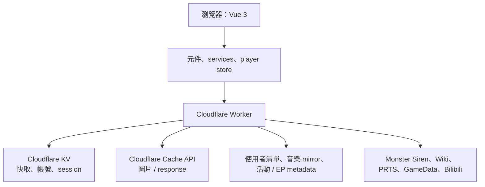

# 架構與資料流

## 全貌

## 請求路徑

| 資料 | 前端入口 | Worker 路徑 / 行為 | 儲存或來源 |
| --- | --- | --- | --- |
| 音樂與專輯 | `services/api.js` | 音樂 proxy、mirror、預熱 | Monster Siren + Supabase |
| 歌詞翻譯 | `lyricsTranslationPlugin.js` | `POST /api/lyrics/translate`，翻譯 cache | KV / translation endpoint |
| 幹員 | `services/api.js` | `/api/recruit/operators*` | Wiki / GameData + KV |
| 圖片 | asset manifest / API | `/api/recruit/image` fallback proxy | 本機資產或外部 raw + Cache API |
| 活動與卡池 | `activityApi.js` | `/api/activities` | Supabase / curated catalog |
| 個人清單 | `auth.js`、`userLibrary.js` | `/api/auth/*`、`/api/user/*` | KV session + Supabase |
| 角色 EP | `PlayerView.vue` | `/api/song/:id/character-ep` | Supabase metadata + Bilibili iframe |

## Cache 變更原則

只有當已快取的資料結構會讓新程式錯誤時，才提升 cache key 版本，例如 `recruit:operators:v3`。純 CSS、元件視覺或不影響 JSON 結構的變動不應任意升版，否則會造成不必要的冷快取與外部請求。
