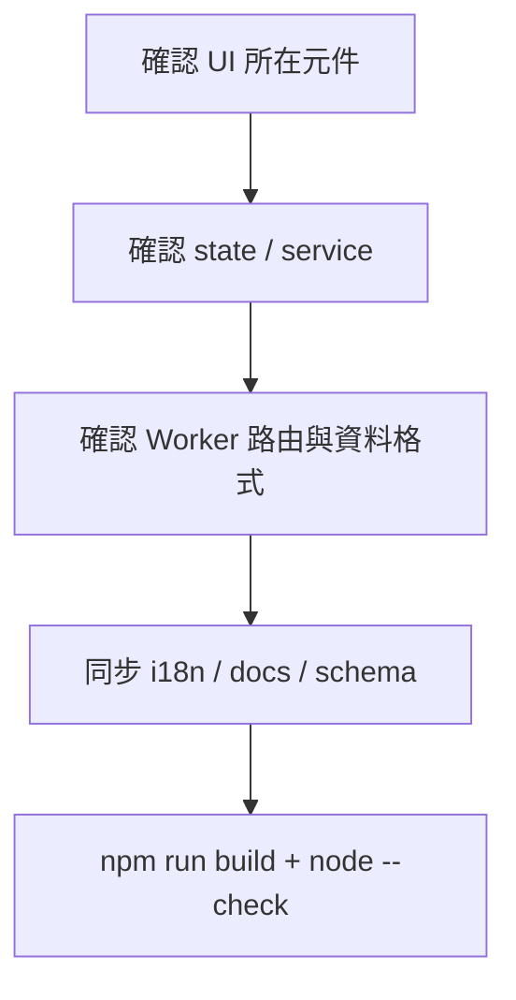

# 開發者入門

## 本機啟動

```bash
npm install
npm run dev
```

| 工作 | 指令 | 說明 |
| --- | --- | --- |
| 建置前端 | `npm run build` | 產出 `dist/` |
| 檢查 Worker 語法 | `node --check worker/index.js` | 不會部署 Worker |
| 啟動 Worker | `npm run worker:dev` | 需要 Wrangler 相關設定 |
| 檢查資產 | `npm run assets:audit` | 檢查本機幹員資產覆蓋情況 |
| 同步角色 EP | `npm run character-eps:sync` | 需要 Supabase 設定；可選 Bilibili cookie |

## 每次功能修改的閱讀順序



## 程式責任

| 層級 | 位置 | 原則 |
| --- | --- | --- |
| 畫面 | `src/components/` | 負責互動與呈現；避免把 API 細節塞進元件 |
| 共用狀態 | `src/stores/player.js` | 播放器、Modal 與目前資料的單一來源 |
| 前端服務 | `src/services/` | 統一處理 API、登入 token、快取與資產路徑 |
| 後端 | `worker/index.js` | 路由、驗證、外部資料整合、cache 與 Supabase |
| 靜態資料 | `src/data/`、`public/images/manifest/` | 由腳本產生的資料需保留來源與更新方式 |

## 環境設定原則

- 前端公開設定使用 `VITE_*`；不要放任何 secret。
- `SYNC_TOKEN` 與 `SUPABASE_SERVICE_ROLE_KEY` 只存在 Cloudflare / GitHub Secrets。
- 對外 API 的回應格式變動時，要同時檢查 Worker cache key、前端 service 與對應 UI。
- 新增可見文字時，更新 `src/i18n/` 和 `src/i18n/userLibraryMessages.js` 的五種語言。
