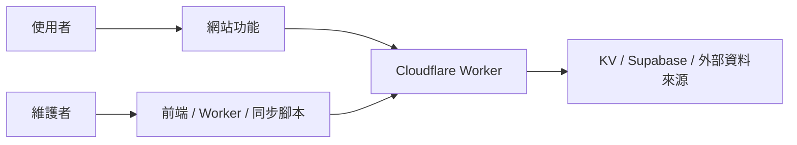

# Arknights Music Web Wiki

這份 Wiki 是給網站使用者與後續開發者的共同入口。它保留在 repository 的 `docs/wiki/`，以便與程式碼一起審查、版本化；若使用 GitHub Wiki，可將本目錄各 Markdown 頁面同步到 Wiki repository。

## 從這裡開始

| 你想知道什麼？ | 前往頁面 |
| --- | --- |
| 網站可做什麼、怎麼用 | [使用指南](User-Guide.md) |
| 如何在本機開發與建置 | [開發者入門](Developer-Guide.md) |
| 前後端如何協作 | [架構與資料流](Architecture.md) |
| 怎麼部署與管理同步 | [部署與營運](Operations.md) |
| 哪些檔案該提交或清理 | [資料夾策略](Folder-Policy.md) |

## 文件狀態

- 本 Wiki 反映 repository 目前的程式結構。
- 角色 EP 是透過 Bilibili 嵌入播放，影片 metadata 由同步流程整理。
- 金鑰、session 或 Supabase service role key 絕不應出現在 Wiki、issue 或 commit。
