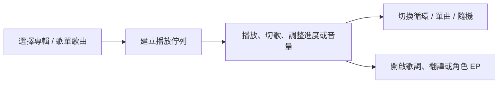

# 使用指南

## 頁面與功能

| 頁面 | 對象 | 主要用途 |
| --- | --- | --- |
| 專輯 | 所有人 | 搜尋、瀏覽與播放塞壬唱片歌曲 |
| 幹員圖鑑 | 所有人 | 篩選幹員並查看完整資料 |
| 招募卡 | 所有人 | 製作可分享的招募風格卡片 |
| 公開招募 | 所有人 | 用標籤推算可能出現的幹員 |
| 活動 | 所有人 | 檢視各伺服器活動、卡池與取得方式 |
| 我的清單 | 已登入使用者 | 管理最愛、歌單與角色清單 |

## 播放器操作

- 從專輯播放時，上一首、下一首與隨機播放都以該專輯歌曲為範圍。
- 從自訂歌單播放時，播放範圍會留在該歌單。
- 歌詞翻譯為需要時才請求的功能；切換歌曲後預設回到關閉。
- 「角色 EP」只有該歌曲已有可信配對影片時才可用，會以 Bilibili iframe 播放。

## 帳號與我的清單

不登入仍可完整使用公開功能。登入後可：

1. 將歌曲加入或移出我的最愛。
2. 建立歌單，新增、移除、重新命名或刪除歌單內容。
3. 建立自己的角色清單，將幹員集中分類。

帳號以登入 Key 與密碼識別。請使用自己能記住且不與其他網站共用的密碼。

## 分享連結

歌曲分享網址可直接開啟對應播放器；幹員分享網址可直接開啟對應的幹員詳細內容。分享後的外部平台預覽取決於其是否讀取 Open Graph metadata。
